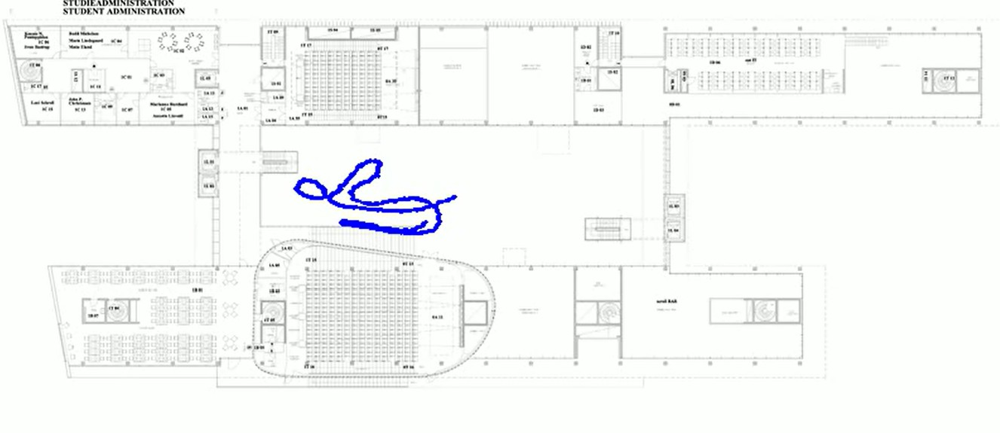
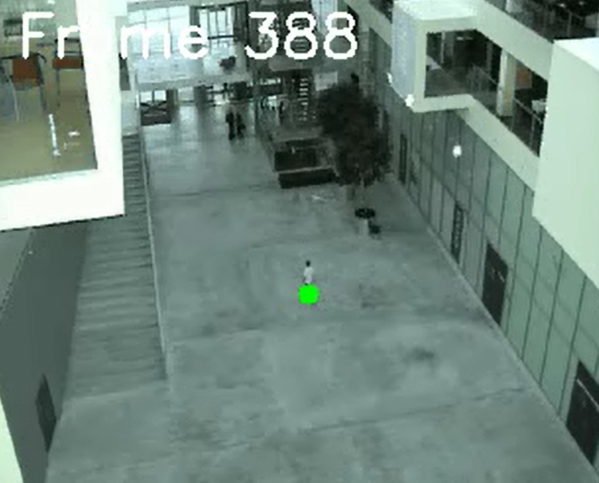

# Learning an Affine 2D Transformation

This project demonstrates how to learn and apply a 2D affine transformation to map tracked image coordinates to a spatial overview map. It showcases my ability to combine geometric modeling, data preprocessing, and visualization in a machine learning context.

## What I Built
- A complete pipeline to estimate an affine transformation matrix from paired image coordinates  
- A system to transform and visualize tracking data from a video onto a spatial map  
- Modular functions for data loading, transformation, and plotting, optimized for clarity and reuse  

## Implementation
- Constructed a design matrix to solve for affine parameters using linear regression  
- Applied homogeneous coordinate transformations for accurate spatial mapping  
- Visualized transformed paths for multiple body regions to assess model precision  
- Refactored transformation logic into reusable functions (`calc_affine`, `apply_affine`, `transform_points`)  

## Techniques Used
- Linear least squares estimation for parameter learning  
- Homogeneous coordinate systems for affine transformations  
- Frame-wise center extraction and mapping for dynamic visualization  
- Comparative analysis of transformed regions to evaluate model fidelity  

## Outcome
The final result is a clean overlay of tracked movement on a spatial map, enabling further analysis of motion patterns, speed, and positional accuracy.

## 📸 Examples

Below are two visual examples from the project:

### Spatial Plan

### Camera Tracking

